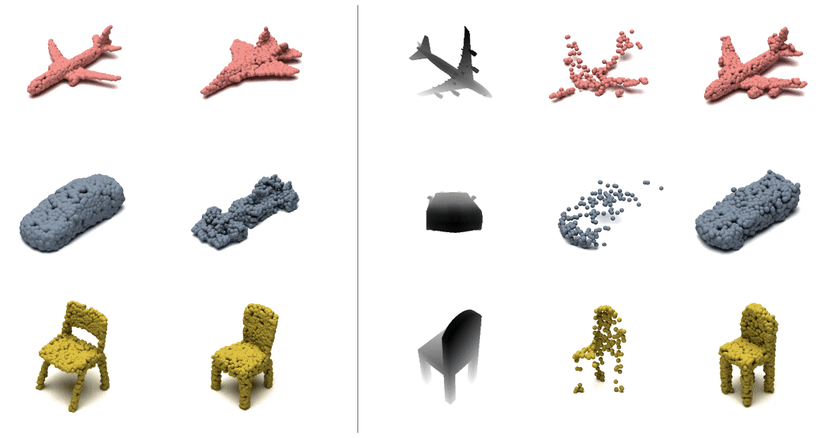
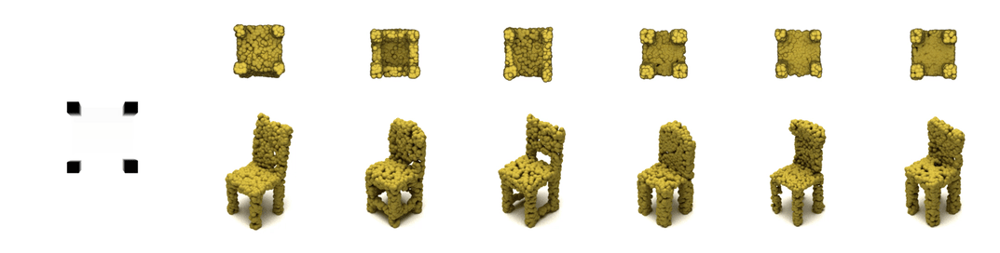

# RGB-Conditioned Point-Voxel Diffusion
<p align="center">
  
</p>

Implementation of RGB-Conditioning Part of Text and Image Conditional Point-Voxel Diffusion

## Requirements:

Make sure the following environments are installed.

```
python==3.6
pytorch==1.4.0
torchvision==0.5.0
cudatoolkit==10.1
matplotlib==2.2.5
tqdm==4.32.1
open3d==0.9.0
trimesh=3.7.12
scipy==1.5.1
```

Install PyTorchEMD by
```
cd metrics/PyTorchEMD
python setup.py install
cp build/**/emd_cuda.cpython-36m-x86_64-linux-gnu.so .
```

The code was tested on RTX 3090

## Data

For generation, we use ShapeNet point cloud, which can be downloaded [here](https://github.com/stevenygd/PointFlow).
RGB Image for conditioning can be obtained from [here](https://huggingface.co/datasets/ShapeNet/ShapeNetCore) under /screenshots.

## Pretrained models
Pretrained models can be downloaded [here](https://drive.google.com/drive/folders/1Q7aSaTr6lqmo8qx80nIm1j28mOHAHGiM?usp=sharing).

## Training:

```bash
$ python train_generation.py --category car|chair|airplane --concatenation direct_sum | attention
```

Please refer to the python file for optimal training parameters.

## Testing:

Testing original PVD model
```bash
$ python train_generation.py --category car|chair|airplane --model MODEL_PATH --origianl_pvd_model True 
```
Testing our model
```bash
$ python train_generation.py --category car|chair|airplane --model MODEL_PATH --concatenation direct_sum | attention
```

## Results

Some generation and completion results are as follows.
<p align="center">
  
</p>

Multimodal completion on a ShapeNet chair.
<p align="center">
  
</p>


Multimodal completion on PartNet.
<p align="center">
  
</p>


Multimodal completion on two Redwood 3DScan chairs.
<p align="center">
  
</p>

## Reference

```
@inproceedings{Zhou_2021_ICCV,
    author    = {Zhou, Linqi and Du, Yilun and Wu, Jiajun},
    title     = {3D Shape Generation and Completion Through Point-Voxel Diffusion},
    booktitle = {Proceedings of the IEEE/CVF International Conference on Computer Vision (ICCV)},
    month     = {October},
    year      = {2021},
    pages     = {5826-5835}
}
```

## Acknowledgement

For any questions related to codes and experiment setting, please contact [Linqi Zhou](linqizhou@stanford.edu) and [Yilun Du](yilundu@mit.edu). 
